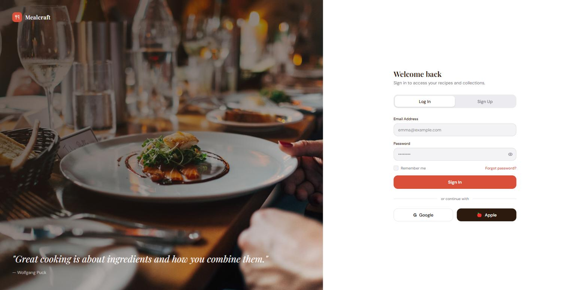
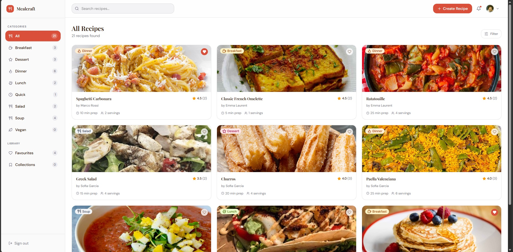
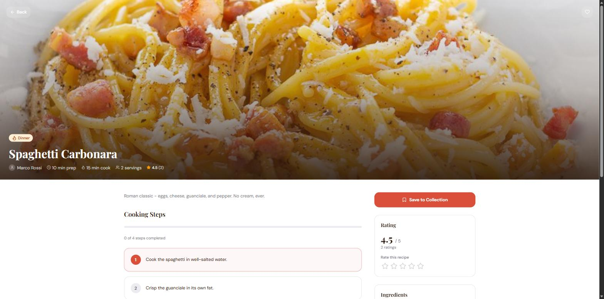
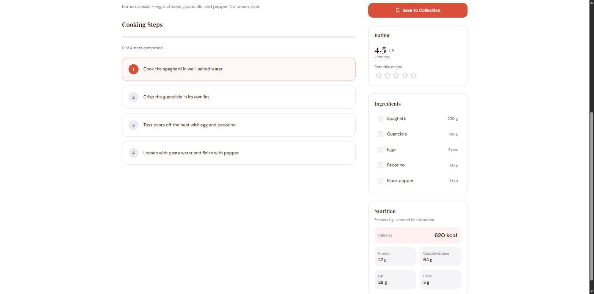
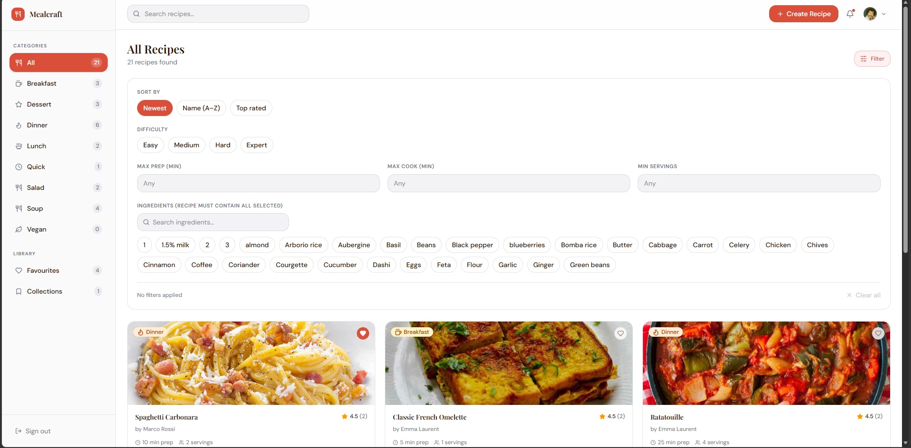
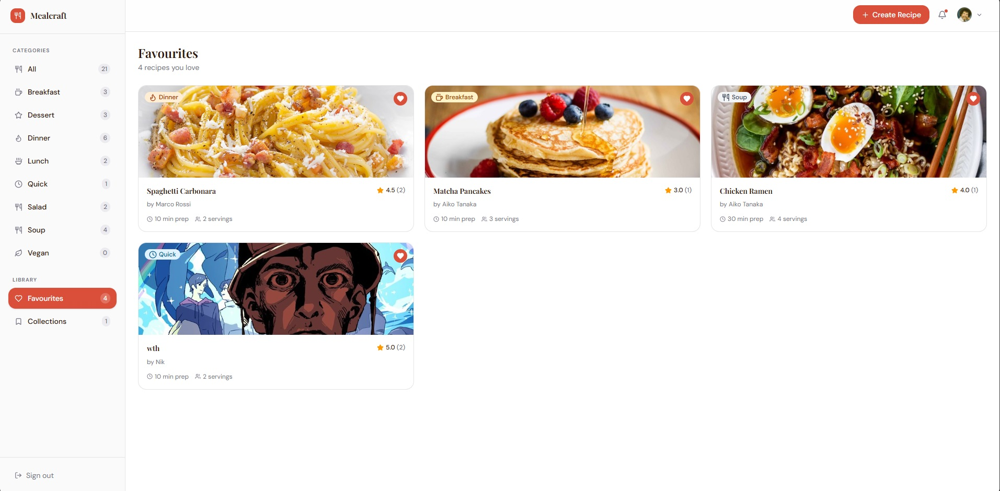
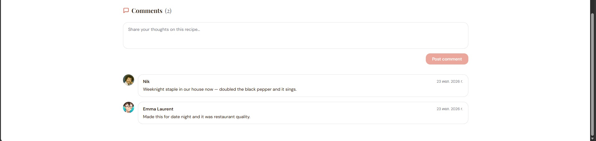
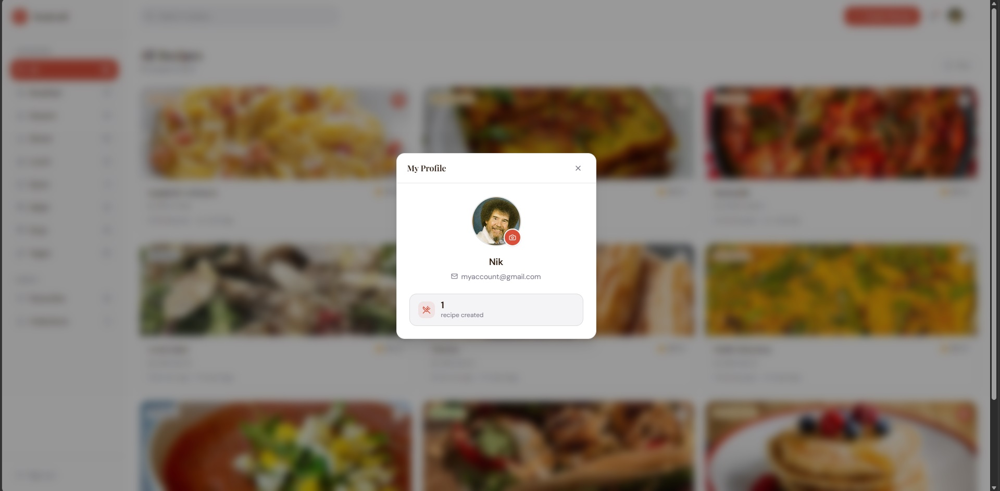

# RecipeManager

RecipeManager lets users register, create, and share recipes — ordered cooking steps, ingredients with units, and a cover image — then browse, search, filter, rate, favourite, and organise them into collections. Per-serving nutrition is calculated automatically from the ingredients (sourced from USDA FoodData Central) or entered by hand.

## Features

- **Recipes** — create and edit with ordered steps (stored as a linked list),
  ingredients with quantities and units, difficulty, prep/cook times, servings,
  and a cover image (up to 10 MB). Editing and deletion are owner-only.
- **Discovery** — server-side search and pagination, a category sidebar, and a
  filter panel (difficulty, max prep/cook time, min servings, "must contain
  these ingredients", and sort by newest / name / top-rated).
- **Ratings** — real per-user 1–5 star ratings, averaged on the server.
- **Comments** — leave feedback on any recipe; edit or delete your own.
- **Favourites & Collections** — like recipes, and organise them into your own
  private, named collections.
- **Nutrition** — per-serving calories, protein, fat, carbohydrates, and fibre
  computed from the ingredients (USDA-sourced and cached per ingredient) with
  coverage reporting, plus a manual per-serving override for complex recipes.
- **Profiles** — display name, email, recipe count, and avatar upload.
- **Auth** — JWT access tokens with rotating refresh tokens.

## Screenshots

| Sign in | Browse recipes | Recipe detail |
|---|---|---|
|  |  |  |

| Ingredients & nutrition | Filters | Favourites |
|---|---|---|
|  |  |  |

| Recipe comments | Your profile |
|---|---|
|  |  |

## Tech stack

| Layer | Stack |
|-------|-------|
| Backend | .NET 10, Clean Architecture (Domain / Application / Infrastructure / Api), MediatR (CQRS), EF Core 10 + Npgsql |
| Database | PostgreSQL 17 |
| Auth | JWT access tokens + rotating refresh tokens |
| Nutrition | USDA FoodData Central, cached per ingredient |
| Frontend | React 19, Vite 8, TypeScript, TanStack Query, Zustand, Axios, Tailwind v4 |
| Tests | xUnit + NSubstitute + Testcontainers (backend), Vitest + React Testing Library (frontend) |
| CI/CD | GitHub Actions + Docker Compose |

## Project layout

```
src/
  RecipeManager.Domain/          # entities, interfaces, enums, nutrition calc — no external deps
  RecipeManager.Application/     # CQRS use cases, DTOs (MediatR)
  RecipeManager.Infrastructure/  # EF Core, repositories, JWT, file storage, USDA provider
  RecipeManager.Api/             # controllers, middleware, DI wiring
tests/                           # Domain / Application unit + Api integration tests
client/                          # React + Vite + TypeScript SPA
scripts/                         # start / stop 
docs/screenshots/                # images used in this README
docker-compose.yml               # db + api + client
```

## Learning goals

- Clean Architecture and SOLID principles in C#
- RESTful API design with versioning, pagination, and RFC 9457 error responses
- Data structures — `LinkedList<T>` for recipe steps, `Dictionary<K,V>` for
  category indexing, `List<T>` for search results
- EF Core migrations, repository pattern, and PostgreSQL integration
- JWT authentication with access + refresh token rotation
- Integrating a rate-limited external API (USDA) with write-through caching and
  a pure, testable calculation core
- TanStack Query + Zustand for frontend state management
- CI/CD with GitHub Actions and Docker Compose

## Quick start (Docker — recommended)

The fastest way to see the app running. Requires **Docker Desktop**.

```bash
docker compose up --build
```

Then open **http://localhost:5173** in your browser. On startup the API automatically applies the database migrations.

| Service  | URL |
|----------|-----|
| Web app  | http://localhost:5173 |
| API      | http://localhost:8080/api/v1 |
| Postgres | localhost:5432 (postgres / postgres) |

Full step-by-step instructions, troubleshooting, and how to exercise every feature are in **[USAGE_GUIDE.md](USAGE_GUIDE.md)**.